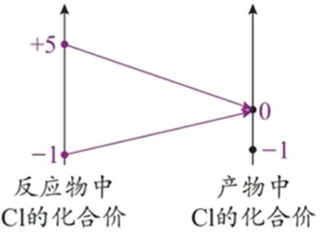
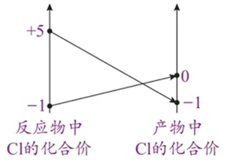

## [1-10]氧化还原反应的特殊规律

可以根据化合价的变化特征将氧化还原反应分为歧化反应、归中反应、完全氧化还原反应等。不同类型的氧化还原反应，有些规律相似，有些规律差异很大。即氧化还原反应的规律存在普遍性和特殊性。

#### 1. 归中反应——同种元素的价态变化“可靠拢，不交叉”规律

<table>
<thead>
<tr><th colspan=3>以反应：$\text{KClO}_3 + 6\text{HCl} = 3\text{Cl}_2 \uparrow + \text{KCl} + 3\text{H}_2\text{O}$ 为例</th></tr>
</thead>
<tbody>
<tr><td>正确分析(靠拢)</td><td>氧化剂 $\text{KClO}_3$ 的＋5价 Cl 以及还原剂 $\text{H}\text{Cl}$ 的－1价 Cl 均变成 0价的 $\text{Cl}_2$，$\text{Cl}_2$ 既是氧化产物，又是还原产物。每生成 3个 $\text{Cl}_2$，转移 5个电子。</td><td></td></tr>
<tr><td>错误分析(交叉)</td><td>氧化剂 $\text{KClO}_3$ 的＋5价 Cl 变成 $\text{K}\text{Cl}$ 中的－1价 Cl，还原剂 $\text{H}\text{Cl}$ 的－1价 Cl 变成 0价的 $\text{Cl}_2$，错误原因是 Cl 元素的化合价出现交叉。</td><td></td></tr>
</tbody>
</table>

#### 2. 歧化反应
绝大多数的歧化反应遵循“邻价”规律，即变价元素的化合价常往相邻价态变化。高中常见的歧化反应如下表：

<table>
 <thead>
 <tr>
 <th>元素化合价</th>
 <th>化学方程式</th>
 </tr>
 </thead>
 <tbody>
 <tr>
 <td>过氧化物(-1价O)</td>
 <td>$2\text{Na}_2\text{O}_2 + 2\text{H}_2\text{O} = 4\text{NaOH} + \text{O}_2 \uparrow$ $2\text{Na}_2\text{O}_2 + 2\text{CO}_2 = 2\text{Na}_2\text{CO}_3 + \text{O}_2$ $2\text{H}_2\text{O}_2 \overset{\text{催化剂}}{=} 2\text{H}_2\text{O} + \text{O}_2 \uparrow$</td>
 </tr>
 <tr>
 <td>$\text{Cl}_2(0$价Cl)</td>
 <td>$\text{Cl}_2 + \text{H}_2\text{O} \rightleftharpoons \text{HCl} + \text{HClO}$ $\text{Cl}_2 + 2\text{NaOH} = \text{NaCl} + \text{NaClO} + \text{H}_2\text{O}$ $2\text{Cl}_2 + 2\text{Ca(OH)}_2 = \text{CaCl}_2 + \text{Ca(ClO)}_2 + 2\text{H}_2\text{O}$</td>
 </tr>
 <tr>
 <td>$\text{N}\text{O}_2(+4$价N)</td>
 <td>$2\text{NO}_2 + 2\text{NaOH} = \text{NaNO}_2 + \text{NaNO}_3 + \text{H}_2\text{O}$</td>
 </tr>
 <tr>
 <td>$\text{Cu}_2\text{O}(+1$价Cu)</td>
 <td>$\text{Cu}_2\text{O} + \text{H}_2\text{SO}_4 = \text{Cu} + \text{CuSO}_4 + \text{H}_2\text{O}$</td>
 </tr>
 </tbody>
</table>

