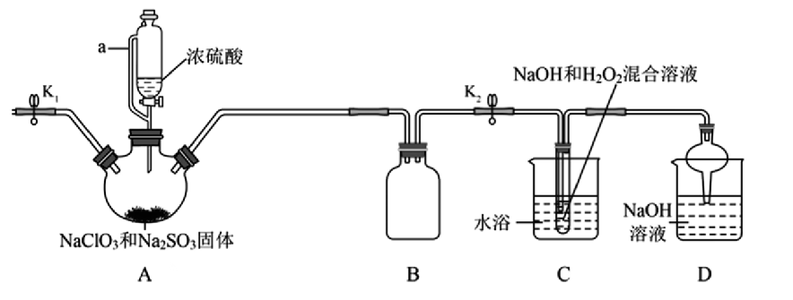

## [1-12]新情景下氧化还原方程式的书写 课程讲义

#### 1.书写化学方程式的步骤与方法
(1)根据题干信息或流程图，确定题目所给的“两剂两产物”，写出完整的“氧化剂＋还原剂→还原产物＋氧化产物”
(2)根据化合价升降守恒，配平“两剂两产物”
(3)根据化合价未变的原子守恒(先确定非 H、非 O 原子)，补充剩余的反应物和产物
(4)根据 H 原子守恒补 $\text{H}_2\text{O}$，最后检查 O 原子守恒，完成方程式配平

#### 2. 书写离子方程式的步骤与方法——缺项配平
例：将$\text{SO}_2$通入酸性$\text{KMnO}_4$溶液中，$\text{SO}_2$被氧化为$\text{SO}_4^{2-}$，$\text{MnO}_4^-$被还原为$\text{Mn}^{2+}$，书写反应的离子方程式：

<table>
 <thead>
 <tr>
 <th>步骤</th>
 <th>方法</th>
 <th>解释</th>
 <th>实例</th>
 </tr>
 </thead>
 <tbody>
 <tr>
 <td>(1)</td>
 <td>根据信息写“四样”</td>
 <td>先利用信息写出氧化剂、还原剂、还原产物、氧化产物</td>
 <td>$\text{MnO}_4^- + \text{SO}_2 \longrightarrow \text{Mn}^{2+} + \text{SO}_4^{2-}$ $氧化剂＋还原剂—→还原产物＋氧化产物$</td>
 </tr>
 <tr>
 <td>(2)</td>
 <td>根据化合价升降守恒配平两剂两产物</td>
 <td>利用化合价的升降守恒，确定氧化剂、还原剂、还原产物、氧化产物的化学计量数</td>
 <td>$2 \overset{+7\quad}{\underset{\downarrow 5 \times 2\quad}{\text{MnO}_4^-}} + 5 \overset{+4\quad}{\underset{\uparrow 2 \times 5\quad}{\text{SO}_2}} \longrightarrow 5\overset{+2\quad\quad}{\text{Mn}^{2+}} + 2\overset{+6\quad\quad}{\text{SO}_4^{2-}}$</td>
 </tr>
 <tr>
 <td>(3)</td>
 <td>根据电荷守恒以及环境的酸碱性，补$\text{H}^+$或$\text{OH}^-$</td>
 <td>酸性补$\text{H}^+$、碱性补$\text{OH}^-$。（即酸中不生碱、碱中不生酸）</td>
 <td>左侧电荷总数：-2；右侧电荷总数：$5 \times (-2) + 2 \times (+2) = -6$。 为了左右两侧电荷总数相等，且环境为酸性，则需在右侧补4个$\text{H}^+$，即：$2\text{MnO}_4^- + 5\text{SO}_2 \longrightarrow 5\text{SO}_4^{2-} + 2\text{Mn}^{2+} + 4\text{H}^+$</td>
 </tr>
 <tr>
 <td>(4)</td>
 <td>根据$\text{H}$原子守恒，补$\text{H}_2\text{O}$</td>
 <td>根据$\text{H}$原子守恒观察是否补水，以及补在哪里</td>
 <td>左侧无$\text{H}$，右侧4个$\text{H}$，根据$\text{H}$原子守恒，在左侧补2个$\text{H}_2\text{O}$；即： $2\text{MnO}_4^- + 5\text{SO}_2 + 2\text{H}_2\text{O} \longrightarrow 5\text{SO}_4^{2-} + 2\text{Mn}^{2+} + 4\text{H}^+$</td>
 </tr>
 <tr>
 <td>(5)</td>
 <td>检查$\text{O}$原子守恒</td>
 <td>左右两边$\text{O}$原子个数相等</td>
 <td>$2\text{MnO}_4^- + 5\text{SO}_2 + 2\text{H}_2\text{O} = 5\text{SO}_4^{2-} + 2\text{Mn}^{2+} + 4\text{H}^+$</td>
 </tr>
 </tbody>
</table>

注：①分别计算左右两边的电荷总量时，一定要打草稿，切记“不要”漏掉正、负号。
②注意区分电荷和化合价，二者不是同一概念。电荷指的是粒子符号的右上角，化合价一般写在元素的正上方。但简单离子（只含一种元素，且只有一个原子的离子）的电荷数等于化合价。
③溶液呈酸性，离子方程式不一定会出现$\text{H}^+$；即使出现$\text{H}^+$，也不一定补在等号的左侧。酸性条件下，是否补$\text{H}^+$，以及$\text{H}^+$补在哪，补几个$\text{H}^+$，都由电荷守恒来决定。同理，碱性条件下，是否补$\text{O}\text{H}^-$，以及$\text{O}\text{H}^-$补在哪，补几个$\text{O}\text{H}^-$，也由电荷守恒来决定。

#### 3. 例题
##### 根据信息和要求推导下列氧化还原反应的方程式
(1)草酸$(\text{H}_2\text{C}_2\text{O}_4)$与硫酸酸化的$\text{K}\text{Mn}\text{O}_4$反应，生成$\text{Mn}\text{S}\text{O}_4$与$\text{C}\text{O}_2$，写出该反应的化学方程式：  ___________________________________
(2)将$\text{Cl}\text{O}_2$通入$\text{K}\text{I}$、淀粉溶液、稀$\text{H}\text{Cl}$的混合溶液中，$\text{Cl}\text{O}_2$被还原为$\text{Cl}^-$且溶液变蓝，发生反应的化学方程式为：  ___________________________________

(3)$\text{Ni}\text{S}\text{O}_4$在强碱溶液中用$\text{Na}\text{Cl}\text{O}$氧化，可沉淀出能用作镍镉电池正极材料的$\text{Ni}\text{O}\text{O}\text{H}$。已知$\text{Cl}\text{O}^-$被还原为$\text{Cl}^-$，写出该反应的离子方程式：  ___________________________________

【反思】“缺项配平”考查了同学们的有序性思维。解决复杂的氧化还原反应型的离子反应，一定要先利用化合价升降守恒（或得失电子守恒），再利用电荷守恒，最后才利用原子守恒。因为得失电子守恒是氧化还原反应的本质，而化合价升降守恒是氧化还原反应的特征。

##### $\text{Na}\text{Cl}\text{O}_2$在工业生产中常用作漂白剂、脱色剂、消毒剂、拔染剂等。实验室中可用$\text{H}_2\text{O}_2$和$\text{Na}\text{O}\text{H}$混合溶液吸收$\text{Cl}\text{O}_2$的方法制取$\text{Na}\text{Cl}\text{O}_2$，现利用如下装置及试剂制备$\text{Na}\text{Cl}\text{O}_2$晶体：

（1）已知$\text{Na}_2\text{S}\text{O}_3$在反应中被氧化为$\text{Na}_2\text{S}\text{O}_4$，则装置A中生成$\text{Cl}\text{O}_2$气体的化学方程式为：  ___________________________________

（2）装置C中生成$\text{Na}\text{Cl}\text{O}_2$的离子方程式为：  ___________________________________

