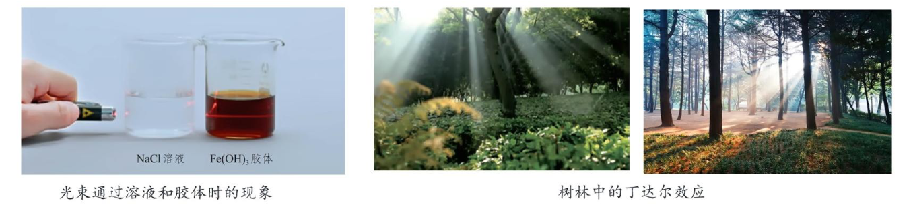

## [1-2]分散系及其分类

#### 1.分散系
##### (1)定义
一种(或多种)物质以粒子形式分散到另一种(或多种)物质中所形成的混合物。
##### (2)组成
分散质和分散剂(一般将量少的视为分散质)。
##### (3)分类
  ①根据分散质、分散剂的状态将分散系分为9类(一般先描述分散质，再描述分散剂)。如氯化铵固体分散在空气中形成的烟为“固气分散系”；又如盐酸小液滴分散在空气中形成的白雾为“液气分散系”。
  ②根据分散质粒子的直径大小将分散系分为3类

  注：i.混合物不一定是分散系(如分层的油和水)，分散系一定是混合物(如振荡后的油水混合物形成的乳浊液)。
  ii.胶体属于分散系，所以胶体肯定是混合物。粒子直径为50 nm的碳酸钙粉末不是胶体，因为碳酸钙是纯净物。将粒子直径为50 nm的碳酸钙粉末分散到空气中或水中形成的分散系才能称为胶体。

#### 2. 胶体
##### (1)定义
分散质粒子的直径为1~100 nm的分散系。
##### (2)本质特征
结构决定性质，胶体区别于其他分散系的本质特征是分散质粒子的直径为1~100 nm。
##### (3)分类
根据分散剂状态不同，可以将胶体分为3类，分别是气溶胶(如雾)、液溶胶(如氢氧化铁胶体)和固溶胶(如有色玻璃)。

##### (4)性质及其用途
①丁达尔效应
i. 定义：当光束通过胶体时，可以看到一条光亮的“通路”，这种现象称为丁达尔效应。
ii. 原因：胶体粒子使光波发生散射（光波偏离原来的方向而分散传播）。
iii. 运用：区别胶体和溶液。

②电泳
i. 定义：通电时，带电的胶体粒子定向移动，这种现象称为电泳。
ii. 原因：胶体分散质具有巨大的比表面积，能吸附带电荷的离子使胶体粒子带电。
iii. 运用：电泳电镀、静电除尘、蛋白质分离等。
注：a. 胶体不带电，胶体粒子才可能带电；不是所有胶体粒子都带电，例如淀粉胶体粒子不带电。
b. 一般情况下，难溶性碱形成的胶体粒子带正电，如 $\text{Fe(OH)}_3$ 胶体粒子；土壤胶体粒子一般带负电，能与 $\text{K}^+$、$\text{NH}_4^+$ 等生物所需营养离子相互作用，使土壤具有保肥能力。
c. 比表面积是指单位质量的物质所具有的总面积。

③聚沉
i. 定义：胶体的分散质粒子聚集成较大的微粒，形成沉淀从分散系里析出的现象。
ii. 措施：加热、搅拌、加入电解质或加入带相反电荷胶体粒子的胶体。
iii. 运用：氯化铁止血、石膏(或氯化镁)溶液使豆浆变成豆腐、入海口形成三角洲、明矾净水、墨水混用导致笔管堵塞等。
注：往氢氧化铁胶体中滴加稀硫酸，先生成红褐色沉淀；继续滴加稀硫酸后沉淀溶解，溶液变为棕黄色。上述现象说明，向胶体中加入少量电解质时发生聚沉，当电解质过量时可能发生化学反应。
④渗析
i. 定义：利用半透膜分离溶液和胶体的过程。
ii. 原因：溶液分散质粒子的直径小于半透膜孔径，而胶体粒子的直径大于半透膜孔径。
iii. 运用：血液透析、淀粉与葡萄糖的分离等。

##### (5)胶体的制备
①操作：将5～6滴$\text{Fe}\text{Cl}_3$饱和溶液滴加到40 mL煮沸的蒸馏水中，继续煮沸至液体呈红褐色，停止加热。
②原理：$\text{FeCl}_3 + 3\text{H}_2\text{O} \overset{\triangle}{=} \text{Fe(OH)}_3(\text{胶体}) + 3\text{HCl}$。
③注意事项：i. 蒸馏水不能用自来水、氨水、氢氧化钠溶液等替代，否则形成$\text{Fe(OH)}_3$沉淀而无法获得胶体；ii. 不能长时间煮沸；iii. 不能搅拌。
