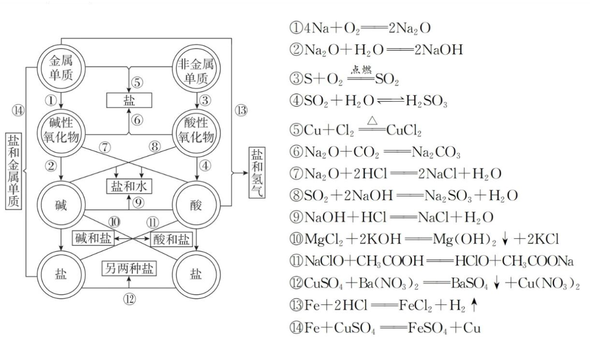

## [1-3]酸碱盐的性质+物质的转化
### 酸碱盐的性质
#### 1. 酸
##### (1) 定义
电离出的阳离子全部都是$\text{H}^+$的化合物。
##### (2) 分类
①根据酸分子是否含氧原子分为含氧酸（如$\text{CH}_3\text{COOH}$、$\text{HClO}$）和无氧酸（如$\text{HCl}$、$\text{HBr}$）。
②根据每个分子可电离出的$\text{H}^+$个数分为一元酸（如$\text{CH}_3\text{COOH}$、$\text{HCl}$）、二元酸（如$\text{H}_2\text{SO}_4$、$\text{H}_2\text{CO}_3$）、多元酸（如$\text{H}_3\text{PO}_4$）。
③根据酸的强弱分为强酸（$\text{HCl}$、$\text{HBr}$、$\text{HI}$、$\text{H}_2\text{SO}_4$、$\text{HNO}_3$、$\text{HClO}_4$）、弱酸（$\text{CH}_3\text{COOH}$、$\text{HClO}$、$\text{H}_2\text{CO}_3$等）。

注：酸的“元数”不是看分子中氢原子的个数，而是看酸分子可电离出的氢离子个数。如$\text{H}_3\text{PO}_4$、$\text{H}_3\text{PO}_3$、$\text{H}_3\text{PO}_2$分子中都有3个氢原子，但每1个酸分子可电离出的氢离子数分别是3、2、1，因此$\text{H}_3\text{PO}_4$为三元酸、$\text{H}_3\text{PO}_3$为二元酸、$\text{H}_3\text{PO}_2$为一元酸。

##### (3) 酸的通性
① 酸能使指示剂显色（使紫色石蕊溶液变红）
② 酸 + 碱 → 盐 + 水
③ 酸 + 碱性氧化物 → 盐 + 水
④ 酸 + 盐 → 新酸 + 新盐
⑤ 酸（非氧化性酸） + 活泼金属单质 = $\text{H}_2\uparrow$ + 盐

注：酸 + 盐 = 新酸 + 新盐，该反应过程一般遵循“强酸制弱酸”或“溶解度大的盐制溶解度小的盐”。此原理中的强与弱、大与小都是相对的，而非绝对。弱酸也可以制更弱的酸，如$CH_3COOH + NaClO = CH_3COONa + HClO$，说明$CH_3COOH$的酸性比$HClO$的强。

#### 2. 碱
##### (1) 定义
电离出的阴离子全部都是$\text{OH}^-$的化合物。
##### (2) 分类
①根据碱在水中的溶解度分为易溶性碱[如$\text{NaOH}$、$\text{KOH}$、$\text{Ba(OH)}_2$]、微溶性碱[如$\text{Ca(OH)}_2$]和难溶性碱[如$\text{Mg(OH)}_2$、$\text{Cu(OH)}_2$]。
②根据每个碱可电离出的$\text{OH}^-$个数分为一元碱[如$\text{NH}_3\cdot\text{H}_2\text{O}$、$\text{NaOH}$]、二元碱[如$\text{Ba(OH)}_2$、$\text{Ca(OH)}_2$]。
③根据碱的强弱分为强碱[$\text{Ba(OH)}_2$、$\text{Ca(OH)}_2$、$\text{NaOH}$、$\text{KOH}$]、弱碱[$\text{NH}_3\cdot\text{H}_2\text{O}$、$\text{Mg(OH)}_2$、$\text{Cu(OH)}_2$等]。
##### (3) 通性
①碱能使指示剂显色（使紫色石蕊溶液变蓝，使酚酞溶液变红）  ②碱+酸 → 盐+水
③碱+酸性氧化物 → 盐+水  ④碱+盐 → 新盐+新碱

注：$\text{NH}_3\cdot\text{H}_2\text{O}$作为产物，若体系温度高写成“$\text{NH}_3\uparrow+\text{H}_2\text{O}$”；若体系温度低写成$\text{NH}_3\cdot\text{H}_2\text{O}$。

#### 3. 盐
##### (1) 定义
能电离出金属阳离子（或铵根离子）和酸根离子的化合物。
##### (2) 分类
①根据电离成分分为正盐（如$\text{BaCl}_2$）、酸式盐（如$\text{NaHSO}_4$）、碱式盐[如$\text{Cu}_2(\text{OH})_2\text{CO}_3$]、复盐[如$\text{KAl(SO}_4\text{)}_2\cdot 12\text{H}_2\text{O}$]等。
②根据溶解度分为易溶性盐（如绝大多数钾、钠、铵盐）、微溶性盐（如$\text{CaSO}_4$、$\text{MgCO}_3$）和难溶性盐（如$\text{BaSO}_4$）。

注：i.正盐是指只能电离出金属阳离子(或铵根离子)和酸根离子的盐，不能电离$\text{H}^+$和$\text{OH}^-$。
ii.能电离出$\text{H}^+$的盐称为酸式盐，能电离出$\text{OH}^-$的盐称为碱式盐，酸式盐的水溶液不一定呈酸性，如酸式盐$\text{NaHSO}_4$、$\text{NaHCO}_3$的溶液分别呈酸性、碱性。酸式盐、碱式盐是盐从电离成分来分类的结果，不是按照水溶液的酸碱性来分类。
iii.能盐电离出的阳离子(除$\text{H}^+$外)大于等于两种，如$\text{NH}_4\text{Fe(SO}_4\text{)}_2$，此类盐称为“复盐”。
##### (3) 通性
①盐+酸 $\rightarrow$ 新盐+新酸  ②盐+碱 $\rightarrow$ 新盐+新碱
③盐+盐 $\rightarrow$ 新盐+新盐  ④盐+金属单质 $\rightarrow$ 新盐+金属单质

### 物质的转化
#### 1. 四大基本反应类型及其通式

<table>
 <thead>
 <tr>
 <th>反应类型</th>
 <th>反应通式</th>
 <th>实例</th>
 </tr>
 </thead>
 <tbody>
 <tr>
 <td>化合反应</td>
 <td>A + B = AB</td>
 <td>$\text{H}_2 + \text{Cl}_2$ $\overset{\text{点燃}}{=}$ 2 $\text{H}\text{Cl}$</td>
 </tr>
 <tr>
 <td>分解反应</td>
 <td>AB = A + B</td>
 <td>2 $\text{H}\text{Cl}\text{O}$ $\overset{\text{光照}}{=}$ 2 $\text{H}\text{Cl} + \text{O}_2$ $\uparrow$</td>
 </tr>
 <tr>
 <td>置换反应</td>
 <td>A + $\text{B}\text{C}$ = BA + C A + $\text{B}\text{C}$ = AC + B</td>
 <td>$\text{Cl}_2$ + 2 $\text{K}\text{I}$ = 2 $\text{K}\text{Cl} + \text{I}_2$ Zn + $\text{Cu}\text{S}\text{O}_4 = \text{Zn}\text{S}\text{O}_4$ + Cu</td>
 </tr>
 <tr>
 <td>复分解反应</td>
 <td>AB + CD = AD + $\text{C}\text{B}$</td>
 <td>$\text{Cu}\text{Cl}_2 + \text{H}_2\text{S} = \text{Cu}\text{S}$ $\downarrow$ + 2 $\text{H}\text{Cl}$</td>
 </tr>
 </tbody>
</table>

注：四大基本反应不能包括所有化学反应，如 $\text{C}\text{O} + \text{Cu}\text{O}$ $\overset{\triangle}{=}$ Cu + $\text{C}\text{O}_2$ 不属于四大基本反应类型中的任何一类。

#### 2. 物质的转换

