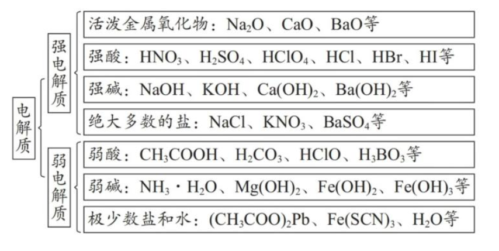
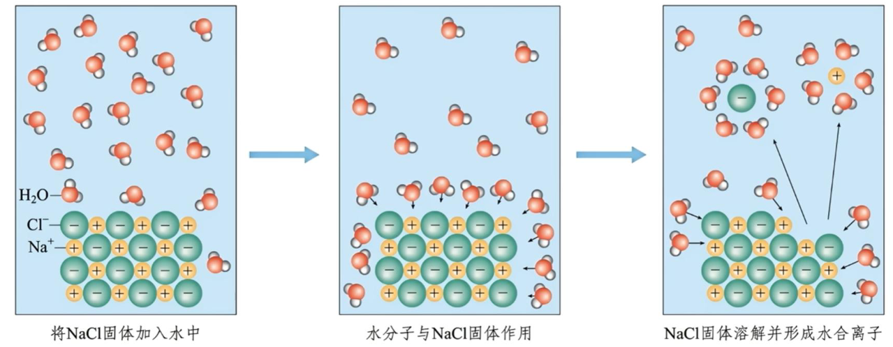
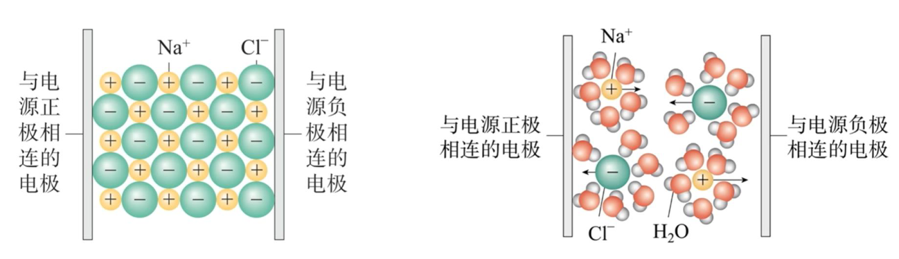
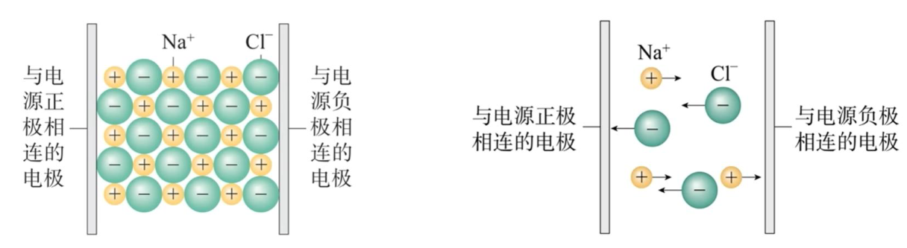

## [1-4]电解质与电离方程式

### 导电的本质
#### 1. 金属导电的本质及其影响因素
(1) 本质：金属的自由电子在外加电场下的定向移动。
(2) 影响因素：金属的电阻率、导线的长度、横截面积、温度等。

#### 2. 溶液导电的本质及其影响因素
(1) 本质：自由移动的离子在外加电场下的定向移动。
(2) 影响因素：电荷浓度=离子浓度×离子所带电荷数。

注：①$\text{Na}\text{Cl}$固体由$\text{Na}^+$、$\text{Cl}^-$构成，但这些离子不能自由移动，因此$\text{Na}\text{Cl}$固体不导电。
    ②影响电解质溶液导电性的因素，还有溶液温度、离子迁移速率等。在高中阶段，大多数题目主要考虑的影响因素是**电荷浓度**。

### 电解质
#### 1. 定义
在水溶液里**或**熔融状态下能够导电的化合物。
#### 2. 定义的理解
(1) “或”表示满足其一即可。如$\text{H}\text{Cl}$的液态（即熔融态）不导电，但$\text{H}\text{Cl}$溶于水形成的盐酸能导电，则$\text{H}\text{Cl}$是电解质；$\text{Ba}\text{S}\text{O}_4$难溶于水，其水溶液几乎不导电，但将其熔化，其熔融态能导电，则$\text{Ba}\text{S}\text{O}_4$是电解质。$\text{Na}\text{Cl}$的水溶液以及熔融态都能导电，所以$\text{Na}\text{Cl}$也是电解质。
(2) “化合物”说明电解质必然是纯净物，单质和溶液不是电解质。

注：$\text{N}\text{H}_3$、$\text{S}\text{O}_2$的水溶液可导电，但$\text{N}\text{H}_3$、$\text{S}\text{O}_2$却不是电解质，这是因为$\text{N}\text{H}_3$、$\text{S}\text{O}_2$溶于水，可与水发生反应：$\text{N}\text{H}_3 + \text{H}_2\text{O} \rightleftharpoons \text{N}\text{H}_3\cdot\text{H}_2\text{O}$、$\text{S}\text{O}_2 + \text{H}_2\text{O} \rightleftharpoons \text{H}_2\text{S}\text{O}_3$。溶液中自由移动的离子来自$\text{N}\text{H}_3\cdot\text{H}_2\text{O}$、$\text{H}_2\text{S}\text{O}_3$，而非$\text{N}\text{H}_3$、$\text{S}\text{O}_2$，$\text{N}\text{H}_3\cdot\text{H}_2\text{O}$、$\text{H}_2\text{S}\text{O}_3$是电解质。

#### 3. 常见电解质
酸、碱、盐、$\text{H}_2\text{O}$和活泼金属氧化物。

#### 4. 分类
根据电解质在水中的电离程度，电解质分为强电解质和弱电解质。若完全电离，则为强电解质；若部分电离，则为弱电解质。

### 电离
#### 1. 电离的定义
电解质溶于水或受热熔化时，形成自由移动的离子的过程。
#### 2. 电解质在水中的电离（以$\text{Na}\text{Cl}$为例）
当将$\text{Na}\text{Cl}$固体加入水中时，在水分子的作用下，$\text{Na}^+$和$\text{Cl}^-$脱离$\text{Na}\text{Cl}$固体的表面，进入水中，形成能够自由移动的水合钠离子和水合氯离子。

#### 3. 电解质水溶液的导电原理（以$\text{Na}\text{Cl}$为例）
当在$\text{Na}\text{Cl}$溶液中插入电极并接通电源时，带正电荷的水合钠离子向与电源负极相连的电极移动，带负电荷的水合氯离子向与电源正极相连的电极移动，因而$\text{Na}\text{Cl}$溶液能够导电。

#### 4. 电解质熔融态的导电原理（以$\text{Na}\text{Cl}$为例）

当$\text{Na}\text{Cl}$固体受热熔化时，离子的运动随温度升高而加快，克服了离子间的相互作用，产生了能够自由移动的$\text{Na}^+$和$\text{Cl}^-$，因而$\text{Na}\text{Cl}$在熔融状态时也能导电。

注：(1) 电离是物理变化；电解是化学变化。
(2) 电离的条件是溶解或熔化；电解的条件是通电。
(3) 电离示意图中，一定要体现“异性相吸”的规律。

### 电离方程式
#### 1. 定义
表示电解质电离过程的式子。
#### 2. 书写方法
(1)左侧为电解质，右侧为离子，连接符号用“=”或“⇌”。强电解质的电离过程用“=”连接，弱电解质的电离过程用“⇌”连接。如强酸 $\text{H}_2\text{S}\text{O}_4$、强碱 $\text{Ba}(\text{O}\text{H})_2$、盐 $\text{Na}_2\text{C}\text{O}_3$、弱酸 $\text{H}\text{F}$ 的电离方程式分别为
$H_2SO_4 = 2H^+ + SO_4^{2-}$  
$Ba(OH)_2 = Ba^{2+} + 2OH^-$
$Na_2CO_3 = 2Na^+ + CO_3^{2-}$  
$HF \rightleftharpoons H^+ + F^-$

(2)绝大多数的多元弱酸酸式酸根(如 $\text{H}\text{S}\text{O}_3^-$、$\text{H}\text{C}\text{O}_3^-$ 等)在水中不能完全电离，但 $\text{H}\text{S}\text{O}_4^-$ 在水溶液中能完全电离，则 $\text{Na}\text{H}\text{S}\text{O}_4$ 在水中电离方程式为 $\text{Na}\text{H}\text{S}\text{O}_4 = \text{Na}^+ + \text{H}^+ + \text{S}\text{O}_4^{2-}$。$\text{H}\text{S}\text{O}_4^-$ 在熔融状态下不能电离，则 $\text{Na}\text{H}\text{S}\text{O}_4$ 在熔融状态下的电离方程式为 $\text{Na}\text{H}\text{S}\text{O}_4 = \text{Na}^+ + \text{H}\text{S}\text{O}_4^-$。

(3)书写电离方程式需要配平，其遵循“原子守恒”和“电荷守恒”。“电荷守恒”是指电离方程式左右两边总电荷的数值和符号完全相同。

注：① 多元弱酸分步电离，以第一步为主。如 $\text{H}_2\text{C}\text{O}_3$ 的电离方程式为 $\text{H}_2\text{C}\text{O}_3 \rightleftharpoons \text{H}^+ + \text{H}\text{C}\text{O}_3^-$。
    ② 多元弱碱实质分步电离，为简便起见，视为全部电离，但连接符号仍用“⇌”。如 $\text{Al}(\text{O}\text{H})_3$ 的电离方程式为 $\text{Al}(\text{O}\text{H})_3 \rightleftharpoons \text{Al}^{3+}$ + $3\text{O}\text{H}^-$。多元弱酸和多元弱碱的电离过程，将在《选择性必修1》中重点介绍。