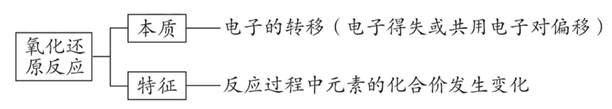
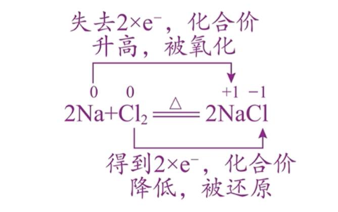
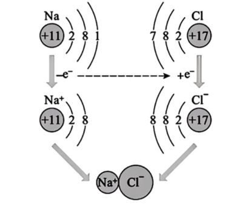
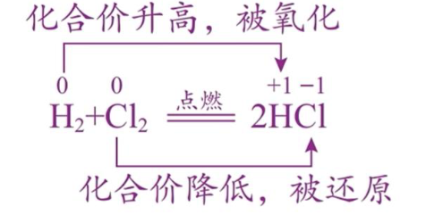
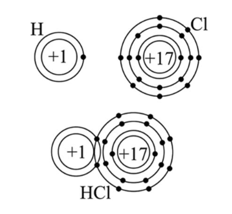
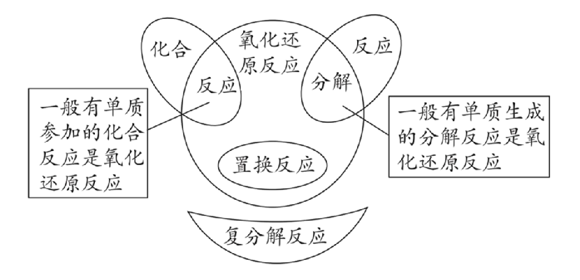

## [1-7]氧化还原反应的基本概念

#### 1. 氧化还原反应的定义
有化合价变化(或电子转移)的化学反应
#### 2. 氧化还原反应的本质及特征

#### 3.化合价与电子转移的关系
##### (1)化合价升降与电子得失的关系
①化学方程式分析 $\text{Na}\text{Cl}$ 的形成过程 

②微观(结构)分析 $\text{Na}\text{Cl}$ 的形成过程

③结论
i. 物质失电子则化合价升高  ii. 物质得电子则化合价降低

##### (2)化合价升降与共用电子对偏移的关系
①化学方程式分析$\text{HCl}$的形成过程  

②微观(结构)分析$\text{HCl}$的形成过程

③结论
i. 共用电子对偏离自己的原子(原子核吸引电子的能力弱一些)则化合价升高
ii. 共用电子对偏向自己的原子(原子核吸引电子的能力强一些)则化合价降低

#### 4.氧化还原反应与四大基本反应的关系

注:离子反应主要包括复分解型和氧化还原反应型

#### 5. 氧化还原反应的分类

<table>
<tbody>
<tr>
<td rowspan=2>歧化反应</td> <td>特征</td> <td>同种物质、同种元素的同一价态，反应中化合价既升高又降低</td>
</tr>
<tr>
<td>实例</td> <td>$\text{Cl}_2 + 2\text{NaOH} = \text{NaCl} + \text{NaClO} + \text{H}_2\text{O}$; $2\text{Na}_2\text{O}_2 + 2\text{H}_2\text{O} = 4\text{NaOH} + \text{O}_2 \uparrow$; $3\text{S} + 6\text{NaOH} = 2\text{Na}_2\text{S} + \text{Na}_2\text{SO}_3 + 3\text{H}_2\text{O}$ </td>
</tr>
<tr>
<td rowspan=2>归中反应 <td>特征 <td>同一元素的高、低两种化合价，反应后化合价向中间价态靠拢但不交叉
</tr>
<tr>
<td>实例 <td>$2\text{H}_2\text{S} + \text{SO}_2 = 3\text{S} \downarrow + 2\text{H}_2\text{O}$; $\text{KClO}_3 + 6\text{HCl} = 3\text{Cl}_2 \uparrow + \text{KCl} + 3\text{H}_2\text{O}$; $2\text{FeCl}_3 + \text{Fe} = 3\text{FeCl}_2$
</tr>
<tr>
<td rowspan=2>部分氧化还原反应 <td>特征 <td>变价元素的原子只有部分化合价改变
</tr>
<tr>
<td>实例 <td>$8\text{NH}_3 + 3\text{Cl}_2 = 6\text{NH}_4\text{Cl} + \text{N}_2$; $3\text{Cu} + 8\text{HNO}_3(\text{稀}) = 3\text{Cu}(\text{NO}_3)_2 + 2\text{NO} \uparrow + 4\text{H}_2\text{O}$
</tr>
<tr>
<td rowspan=2>完全氧化还原反应 <td>特征 <td>变价元素的原子全部参加反应
</tr>
<tr>
<td>实例 <td>$4\text{NH}_3 + 5\text{O}_2 \overset{\text{催化剂}}{\underset{\triangle}{=}} 4\text{NO} + 6\text{H}_2\text{O}$; $4\text{FeS}_2 + 11\text{O}_2 \overset{\triangle}{=} 2\text{Fe}_2\text{O}_3 + 8\text{SO}_2$
</tr>
</tbody>
</table>