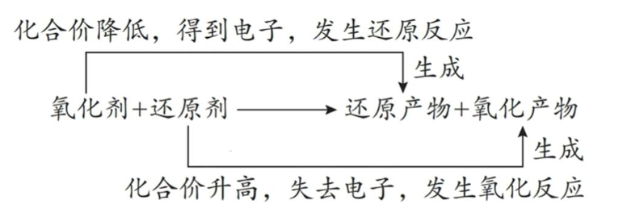

## [1-8]氧化剂与还原剂
#### 1. 氧化剂
##### (1) 定义
反应中得到电子(所含元素化合价降低)的反应物
##### (2) 常见氧化剂(化合价容易降低的物质)
①非金属单质：$\text{O}_2$、$\text{Cl}_2$、$\text{Br}_2$等
②含有高价态元素的化合物：$\text{H}\text{N}\text{O}_3$、$\text{K}\text{Mn}\text{O}_4$、$\text{Mn}\text{O}_2$、浓$\text{H}_2\text{S}\text{O}_4$、$\text{K}_2\text{Cr}_2\text{O}_7$等
③某些金属阳离子：$\text{Fe}^{3+}$、$\text{Ag}^+$、$\text{Cu}^{2+}$等
④过氧化物：$\text{H}_2\text{O}_2$、$\text{Na}_2\text{O}_2$、$\text{Ca}\text{O}_2$等
⑤$\text{H}\text{Cl}\text{O}$、$\text{Cl}\text{O}^-$、$\text{H}\text{N}\text{O}_2$等

#### 2. 还原剂
##### (1) 定义
反应中失去电子(所含元素化合价升高)的反应物
##### (2) 常见还原剂(化合价容易升高的物质)
①活泼金属单质：K、Ca、Na、Mg、Al、Zn、Fe等
②非金属元素的简单阴离子及低价态化合物：$\text{S}^{2-}$、$\text{I}^{-}$、$\text{C}\text{O}$、$\text{SO}_2$、$\text{H}_2\text{SO}_3$、$\text{Na}_2\text{SO}_3$等
③某些低价态金属阳离子：$\text{Fe}^{2+}$、$\text{Cu}^{+}$等
④非金属单质及氢化物：$\text{H}_2$、C、$\text{H}_2\text{S}$、$\text{NH}_3$等
⑤氢元素化合价为-1价的化合物：$\text{Li}\text{H}$、$\text{NaBH}_4$等
#### 3. 氧化产物
还原剂失去电子被氧化生成的物质(生成物)
#### 4. 还原产物
氧化剂得到电子被还原生成的物质(生成物)

#### 5. 常见氧化剂、还原剂及其对应的还原产物、氧化产物
##### (1)常考的氧化剂及还原产物
<table>
 <thead>
 <tr>
 <th>氧化剂</th>
 <th>还原产物</th>
 </tr>
 </thead>
 <tbody>
 <tr>
 <td>$\text{KMnO}_4$ (酸性)</td>
 <td>$\text{Mn}^{2+}$</td>
 </tr>
 <tr>
 <td>$\text{MnO}_2$ (酸性)</td>
 <td>$\text{Mn}^{2+}$</td>
 </tr>
 <tr>
 <td>$\text{K}_2\text{Cr}_2\text{O}_7$ (酸性)</td>
 <td>$\text{Cr}^{3+}$</td>
 </tr>
 <tr>
 <td>浓 $\text{HNO}_3$</td>
 <td>$\text{NO}_2$</td>
 </tr>
 <tr>
 <td>稀 $\text{HNO}_3$</td>
 <td>$\text{N}\text{O}$</td>
 </tr>
 <tr>
 <td>浓硫酸(加热)</td>
 <td>$\text{SO}_2$</td>
 </tr>
 <tr>
 <td>$\text{Cl}_2/\text{Br}_2/\text{I}_2$</td>
 <td>$\text{Cl}^-/\text{Br}^-/\text{I}^-$</td>
 </tr>
 <tr>
 <td>$\text{H}_2\text{O}_2$</td>
 <td>$\text{H}_2\text{O}$ (酸性); $\text{OH}^-$ (碱性)</td>
 </tr>
 <tr>
 <td>$\text{Fe}^{3+}$</td>
 <td>$\text{Fe}^{2+}$</td>
 </tr>
 </tbody>
</table>

##### (2)常考的还原剂及氧化产物
<table>
<thead>
<tr><th>还原剂</th><th>氧化产物</th></tr>
</thead>
<tbody>
<tr><td>$\text{Fe}^{2+}$ (酸性)</td><td>$\text{Fe}^{3+}$</td></tr>
<tr><td>Fe</td><td>$\text{Fe}^{2+}$ 或 $\text{Fe}^{3+}$</td></tr>
<tr><td>$\text{SO}_2/\text{H}_2\text{SO}_3/\text{SO}_3^{2-}$ (即+4价S)</td><td>$\text{SO}_4^{2-}$</td></tr>
<tr><td>$\text{H}_2\text{S}/\text{S}^{2-}$ (即-2价S)</td><td>一般生成 S</td></tr>
<tr><td>$\text{H}_2\text{O}_2$</td><td>$\text{O}_2$</td></tr>
<tr><td>$\text{X}^{-}$ 或 $\text{HX}(\text{X}=\text{Cl},\text{Br},\text{I})$</td><td>一般生成 $\text{X}_2$</td></tr>
<tr><td>$\text{C}\text{O}$</td><td>$\text{CO}_2$</td></tr>
<tr><td>C</td><td>$\text{CO}_2(\text{O}_2$ 过量)、$\text{CO}(\text{O}_2$ 少量或高温下 $\text{C}$ 过量)</td></tr>
</tbody>
</table>

#### 6. 氧化还原反应中的基本概念及其关系

<table>
 <tr>
 <th>特征</th>
 <th>化合价升高</th>
 <th>化合价降低</th>
 </tr>
 <tr>
 <th>本质</th>
 <td>失电子或共用电子对偏离</td>
 <td>得电子或共用电子对偏向</td>
 </tr>
 <tr>
 <th>反应物</th>
 <td>还原剂</td>
 <td>氧化剂</td>
 </tr>
 <tr>
 <th>性质</th>
 <td>还原性</td>
 <td>氧化性</td>
 </tr>
 <tr>
 <th>过程</th>
 <td>被氧化</td>
 <td>被还原</td>
 </tr>
 <tr>
 <th>反应类型</th>
 <td>氧化反应</td>
 <td>还原反应</td>
 </tr>
</table>

方法一：
升、失、氧化、还原剂、具有还原性；降、得、还原、氧化剂、具有氧化性。
解释：化合价升高、失电子、发生氧化反应/被氧化、作还原剂、具有还原性；化合价低、得电子、发生还原反应/被还原、作氧化剂、具有氧化性。

方法二
口诀：嬛嬛失声痒痒痒（记忆情节：甄嬛甄嬛，感冒失去声音，喉咙痒痒痒）。

<table>
 <tr>
 <th>字</th>
 <th>嬛</th>
 <th>嬛</th>
 <th>失</th>
 <th>声</th>
 <th>痒</th>
 <th>痒</th>
 <th>痒</th>
 </tr>
 <tr>
 <th>意义</th>
 <td>还原剂</td>
 <td>具有还原性</td>
 <td>失 $e^-$</td>
 <td>化合价升高</td>
 <td>被氧化</td>
 <td>发生氧化反应</td>
 <td>生成氧化产物</td>
 </tr>
</table>

