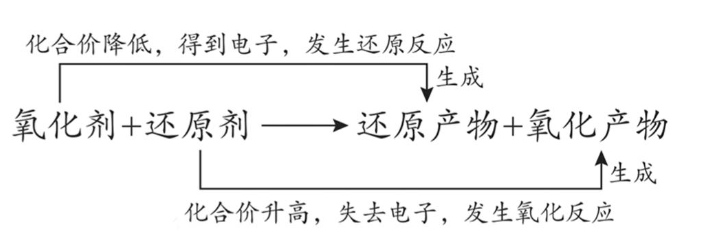

## [1-9]氧化还原反应的普遍规律

#### 1. 氧化性、还原性的判断
##### (1)氧化性与还原性
氧化性是指物质得电子的性质(或能力)；还原性是指物质失电子的性质(或能力)。
##### (2)决定氧化性与还原性强弱的因素
氧化性、还原性的强弱取决于得、失电子的难易程度，与得、失电子数目无关。如：Na单质与Al单质相比，Al失去电子数比Na多。但根据金属活动性顺序表，Na比Al活泼，更易失去电子，所以Na比Al的还原性强。
##### (3)从元素的价态考虑——高氧低还中两性
①最高价态——只有氧化性，如：$\text{HNO}_3$(+5价N)、浓$\text{H}_2\text{SO}_4$(+6价S)、$\text{KMnO}_4$(+7价Mn)、$\text{K}_2\text{Cr}_2\text{O}_7$(+6价Cr)、$\text{FeO}_4^{2-}$(+6价Fe)。(最高价只有氧化性，但不能说明其氧化性就一定强)
②最低价态——只有还原性，如：金属单质、$\text{Cl}^-$、$\text{Br}^-$、$\text{I}^-$、$\text{S}^{2-}$等。(最低价只有还原性，但不能说明其还原性就一定强)
③中间价态——既有氧化性又有还原性，如：$\text{H}_2\text{O}_2$、$\text{Fe}^{2+}$、$\text{S}$、$\text{Cl}_2$、$\text{Br}_2$、$\text{I}_2$等。

注：中间价态的物质在化学反应中体现氧化性还是还原性，关键看与之反应的另一种反应物的性质。如$\text{H}_2\text{O}_2$遇酸性$\text{FeCl}_2$，$\text{H}_2\text{O}_2$体现氧化性，被$\text{Fe}^{2+}$还原成$\text{H}_2\text{O}$；$\text{H}_2\text{O}_2$遇酸性$\text{KMnO}_4$，$\text{H}_2\text{O}_2$体现还原性，被$\text{MnO}_4^-$氧化成$\text{O}_2$；$\text{H}_2\text{O}_2$遇酸性$\text{FeCl}_3$，$\text{H}_2\text{O}_2$既体现氧化性，又体现还原性，被$\text{Fe}^{3+}$催化分解成$\text{H}_2\text{O}$和$\text{O}_2$。因此不要一味地认为$\text{H}_2\text{O}_2$是“绿色氧化剂”，当其遇到强氧化剂$\text{KMnO}_4$时，$\text{H}_2\text{O}_2$就是“绿色还原剂”。所以要仔细审题，具体问题具体分析，尽量不要犯经验主义错误。

④稳定价态——无外加条件时，元素一般往生成稳价产物的方向进行。如：已知N、Cl、Fe的稳价分别为0、-1、+3。
根据“稳价”规律可以推断出反应：$8\text{NH}_3 + 3\text{N}_2\text{O}_4 \overset{\Delta}{=} 7\text{N}_2 + 12\text{H}_2\text{O}$、$2\text{FeCl}_2 + \text{Cl}_2 = 2\text{FeCl}_3$

#### 2.氧化性、还原性强弱比较
##### (1) 依据氧化还原反应原理判断—“由强制弱”
① 氧化性强弱：氧化剂>氧化产物
② 还原性强弱：还原剂>还原产物

注：i若条件为“通电”的反应，一般不遵循由强制弱，如反应$2\text{NaCl}(\text{熔融}) \overset{\text{电解}}{=} 2\text{Na} + \text{Cl}_2\uparrow$中，不能说明氧化性：$\text{NaCl} > \text{Cl}$，也不能说明还原性：$\text{NaCl} > \text{Na}$。
ii.若条件为“高温高压”的反应，可能也不遵循氧化还原反应的由强制弱原理。
如反应$\text{Na} + \text{KCl} \overset{\text{高温}}{=} \text{K}\uparrow + \text{NaCl}$中，用金属$\text{Na}$制备金属$\text{K}$，不能说明还原性：$\text{Na} > \text{K}$。

##### (2)依据相同条件下被氧化(或被还原)的程度
①相同条件下，不同过量氧化剂作用于同一种还原剂，氧化产物价态高的，该氧化剂氧化性强。
例：根据$2\text{Fe} + 3\text{Cl}_2 \overset{\triangle}{=} 2\text{FeCl}_3$，$\text{Fe} + \text{S} \overset{\triangle}{=} \text{FeS}$，可以推知氧化性：$\text{Cl}_2 > \text{S}$。
②相同条件下，不同过量还原剂作用于同一种氧化剂，还原产物价态低的，该还原剂还原性强。
例：根据$\text{Cu} + 2\text{Fe}^{3+} = \text{Cu}^{2+} + 2\text{Fe}^{2+}$，$3\text{Zn} + 2\text{Fe}^{3+} = \text{Zn}^{2+} + 2\text{Fe}$，可以推知还原性：$\text{Zn} > \text{Cu}$。

##### (3)依据同一还原剂(或氧化剂)与不同氧化剂(或还原剂)反应生成同一氧化产物(或还原产物)所需条件的不同，反应条件越苛刻，往往反应物的性质更弱。
例：$\text{MnO}_2 + 4\text{HCl}(\text{浓}) \overset{\triangle}{=} \text{Cl}_2\uparrow + \text{MnCl}_2 + 2\text{H}_2\text{O}$，
$2\text{KMnO}_4 + 16\text{HCl} = 5\text{Cl}_2\uparrow + 2\text{MnCl}_2 + 2\text{KCl} + 8\text{H}_2\text{O}$，
两个化学方程式中的还原剂均为$\text{H}\text{Cl}$，$\text{MnO}_2$氧化$\text{H}\text{Cl}$时，既需要加热，还需要更大浓度的$\text{H}\text{Cl}$，则$\text{MnO}_2$的氧化性弱于$\text{KMnO}_4$的氧化性。

##### (4) 依据金属活动性顺序推还原性、氧化性
①金属元素活动性越强，则金属单质的还原性越强。
还原性：K>Ca>Na>Mg>Al>Zn>Fe>Sn>Pb>(H)>Cu>Hg>Ag>Pt>Au
②金属单质越容易失去电子、还原性越强，则失去电子后生成的阳离子越难得电子、氧化性越弱。
氧化性：$\text{K}^+$<$\text{Ca}^{2+}$<$\text{Na}^+$<$\text{Mg}^{2+}$<$\text{Al}^{3+}$<$\text{Zn}^{2+}$<$\text{Fe}^{2+}$<$\text{Sn}^{2+}$<$\text{Pb}^{2+}$<$(\text{H}^+)$<$\text{Cu}^{2+}$<$\text{Ag}^+$
注：上述氧化性顺序有$\text{Fe}^{2+}$，那么$\text{Fe}^{3+}$的氧化性如何呢？$\text{Fe}^{3+}$的氧化性比$\text{Cu}^{2+}$还强，这个结论大家一定要特殊记忆。$\text{Fe}^{2+}$和$\text{Fe}^{3+}$氧化性不同也能让大家感受同种元素因为电荷量不同所导致的“量变引起质变”。

#### 3.谁强谁优先规律
##### (1)当体系中存在多种还原剂，往体系中加入氧化剂时，氧化剂优先与还原性强的物质反应
①往Zn、Fe的混合物中滴加一定量的稀盐酸后，剩余固体不可能有Zn无Fe，因为金属活动性(即还原性)：Zn>Fe，滴加盐酸后，还原性强的Zn先反应，对应离子方程式为$\text{Zn} + 2\text{H}^+ = \text{Zn}^{2+} + \text{H}_2\uparrow$；待Zn反应完全后，Fe才能与盐酸反应，对应离子方程式为$\text{Fe} + 2\text{H}^+ = \text{Fe}^{2+} + \text{H}_2\uparrow$。由此分析可知，若剩余固体含Zn,则稀盐酸不足，Fe还未开始反应，即剩余固体有Zn就必有Fe。

②往$\text{K}\text{I}$、$\text{K}\text{Br}$、$\text{Fe}\text{Cl}_2$的混合溶液中缓缓通入$\text{Cl}_2$，反应一段时间后，反应后的溶液中，不可能只有$\text{I}^-$而无$\text{Br}^-$、$\text{Fe}^{2+}$，因为还原性：$\text{I}^-$>$\text{Fe}^{2+}$>$\text{Br}^-$，缓缓通入$\text{Cl}_2$，还原性强的$\text{I}^-$先被$\text{Cl}_2$氧化为$\text{I}_2$，对应的离子方程式为$2\text{I}^- + \text{Cl}_2 = \text{I}_2 + 2\text{Cl}^-$；待$\text{I}^-$反应完全后，$\text{Cl}_2$又继续氧化$\text{Fe}^{2+}$，对应的离子方程式为$2\text{Fe}^{2+} + \text{Cl}_2 = 2\text{Fe}^{2+} + 2\text{Cl}^-$；待$\text{Fe}^{2+}$反应完全后，$\text{Cl}_2$最后又去氧化$\text{Br}^-$，对应的离子方程式为$2\text{Br}^- + \text{Cl}_2 = \text{Br}_2 + 2\text{Cl}^-$。

##### (2)当体系中存在多种氧化剂，往体系中加入还原剂时，还原剂优先与氧化性强的物质反应
①已知氧化性：$\text{Ag}^+ > \text{Cu}^{2+}$，往$\text{AgNO}_3$、$\text{Cu(NO}_3\text{)}_2$的混合溶液中加入$\text{Zn}$粉，根据谁强谁优先规律，$\text{Zn}$先与$\text{Ag}^+$反应，对应离子方程式为$\text{Zn} + 2\text{Ag}^+ = \text{Zn}^{2+} + 2\text{Ag}$；待$\text{Ag}^+$被反应完全后，$\text{Zn}$再与$\text{Cu}^{2+}$反应，对应离子方程式为$\text{Zn} + \text{Cu}^{2+} = \text{Zn}^{2+} + \text{Cu}$。

②已知氧化性：$\text{MnO}_4^-$ > $\text{Fe}^{3+}$，往$\text{KMnO}_4$、$\text{Fe}_2(\text{SO}_4)_3$的酸性混合溶液中缓缓通入$\text{SO}_2$，$\text{SO}_2$先与氧化性强的$\text{MnO}_4^-$反应，对应的离子方程式为$2\text{MnO}_4^- + 5\text{SO}_2 + 2\text{H}_2\text{O} = 2\text{Mn}^{2+} + 5\text{SO}_4^{2-} + 4\text{H}^+$，溶液紫红色褪去；待紫红色褪去后，$\text{SO}_2$继续还原$\text{Fe}^{3+}$，对应离子方程式为$2\text{Fe}^{3+} + \text{SO}_2 + 2\text{H}_2\text{O} = 2\text{Fe}^{2+} + \text{SO}_4^{2-} + 4\text{H}^+$，最终溶液为浅绿色。

注：为了更好地掌握“谁强谁优先规律”，请同学们务必识记还原性的强弱顺序。常见还原性由强到弱的顺序：$\text{S}^{2-} > \text{SO}_3^{2-} > \text{I}^- > \text{Fe}^{2+} > \text{Br}^- > \text{Cl}^- > \text{Mn}^{2+}$ (记忆口诀：留呀留点铁，生锈了长绿毛)。考试过程中氧化性顺序往往会已知，可以不用记太多。常见氧化剂由强到弱的顺序：$\text{MnO}_4^- > \text{MnO}_2 > \text{Cl}_2 > \text{Br}_2 > \text{Fe}^{3+} > \text{I}_2 > \text{S}$。

#### 4.守恒规律
氧化还原反应必然遵循两守恒，即“原子守恒”和“得失电子守恒或化合价升降守恒”。若为氧化还原反应型的离子方程式，还会遵循“电荷守恒”。
“得失电子守恒或化合价升降守恒”即：氧化剂得到的电子总数=还原剂失去的电子总数=氧化剂化合价下降总数=还原剂化合价升高总数。“得失电子守恒或化合价升降守恒”规律，在双线桥分析中得以体现。
注：分析歧化反应或归中反应的电子转移数目时，切忌将得电子数和失电子数进行加和！如反应：$\text{Cl}_2 + 2\text{NaOH} = \text{NaCl} + \text{NaClO} + \text{H}_2\text{O}$，$\text{Cl}_2$中的1个Cl原子升1价、失去1个电子；1个Cl原子降1价、得到1个电子，因此每消耗1个$\text{Cl}_2$分子，转移电子数为“1”而不是“2”。